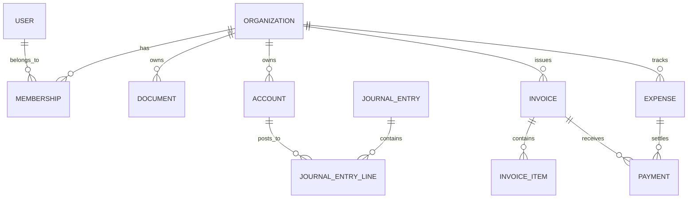

# PHASE 3 — Database Design

## 1. Core Entities

- Organization
- User
- Membership
- Document
- DocumentExtraction
- Account
- JournalEntry
- JournalEntryLine
- Invoice
- InvoiceItem
- Expense
- Payment
- BankAccount
- BankTransaction
- Reconciliation
- TaxRecord
- ComplianceFiling
- Task
- Reminder
- Conversation
- Message
- AuditLog

## 2. Multi-Tenancy Strategy

All tenant-scoped tables should include an organization_id foreign key and every query must filter by the authenticated organization context.

## 3. Important Design Decisions

- Use UUIDs for public identifiers where possible.
- Use DECIMAL for financial values rather than float.
- Keep journal entries immutable after posting.
- Use soft-delete where business history must be preserved.
- Store audit timestamps with created_at/updated_at.

## 4. ER Diagram

